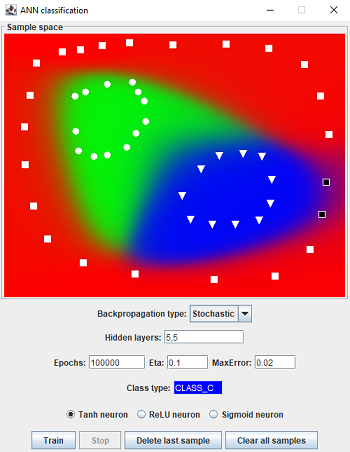
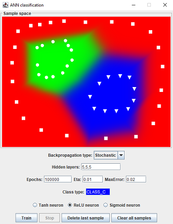

# Classification Based on Artificial Neural Networks

Bachelor of Science Thesis at Faculty of Electrical Engineering and Computing, University of Zagreb, under the 
mentorship of doc. dr. sc. Marko Čupić.

---

### Abstract

Pattern recognition and classification are one of the most important problems in computer science. The biggest
challenge is to construct a good classifier that is capable of generalizing. This paper presents a theoretical view of 
the artificial neural network algorithm through history to the present day and its learning by the Backpropagation
algorithm. Also, in addition to the work, one such learning was implemented through a graphical user interface
through which the user interactively enters points from the 2D coordinate system labeled with different classes and
monitors how well the classifier learns. Representative results are presented and documented in the paper.

**Keywords:** Supervised learning, classification, feedforward neural network, Backpropagation, activation function, 
artificial neuron

---

### Examples

